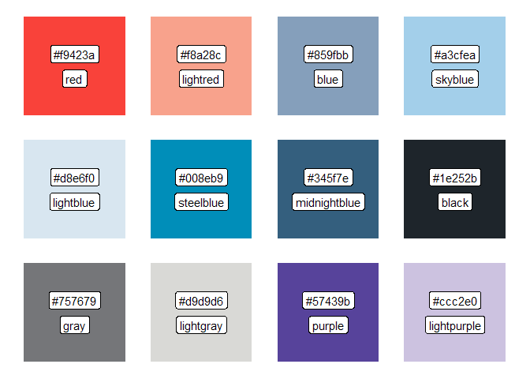

<!-- README.md is generated from README.Rmd. Please edit that file -->
wspviz
======

<!-- badges: start -->
<!-- badges: end -->
Utilities for common R visualization tasks at WSP Finland. Current features:

-   Color palettes for WSP and [HSL](https://hsl.fi/tyyliopas) colors

Planned features:

-   Tailored `ggplot2` themes for WSP and other common contexts

Installation
------------

Ensure you have [`devtools`](https://github.com/r-lib/devtools) installed. To get the latest development version of `wspviz`, run the following command:

``` r
devtools::install_github("webbidevaajat/wspviz")
```

Current version depends on `ggplot2` library (because of `show_palettes()` function).

Examples
--------

Get all the HSL colors as a named vector:

``` r
library(wspviz)
pal_hsl()
#>        bus       tram      metro      train      ferry       bike 
#>  "#007ac9"  "#00985f"  "#ff6319"  "#8c4799"  "#00b9e4"  "#fcb919" 
#>  lightrail  lightblue       pink  lightpink      green lightgreen 
#>  "#00b2a9"  "#bee4f8"  "#f092cd"  "#f4deec"  "#64be1e"  "#d0e6be" 
#>        red     yellow      gray1      gray2      gray3      gray4 
#>  "#dc0451"  "#fed100"  "#333333"  "#636363"  "#999999"  "#dddddd"
```

Get selected WSP colors:

``` r
library(wspviz)
pal_wsp("red", "blue", "gray")
#>       red      blue      gray 
#> "#f9423a" "#859fbb" "#757679"
```

Plot a color palette:

``` r
library(wspviz)
show_palette(pal_wsp())
```



If you are for some reason running the palette functions several times, say, generating 1000 different plots, you can extract the color codes and just use named vector subsetting for a slight performance benefit (comparison has not been made so far), like this:

``` r
library(wspviz)
pal <- pal_hsl()
show_palette(pal[c("bus", "tram", "train", "metro", "ferry")])
```


``` r
# Instead of show_palette(pal_wsp("purple", "midnightblue"))
```
